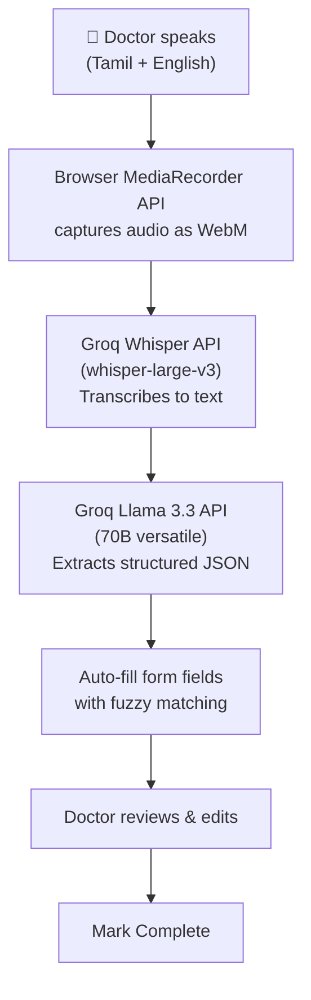

# Voice-to-Form Auto-Fill — Feature Documentation

## What It Does

A **Record** button on the Vet Console lets the doctor **speak** their consultation (in Tamil, English, or a mix), and AI automatically fills in the form fields — Diagnosis, Consultation Notes, Medicines, Vaccines, and Services. The doctor reviews, edits if needed, and clicks Mark Complete.

**Problem it solves:** Manually typing every field during a consultation is time-consuming. This reduces a 3–5 minute form-filling process to ~30 seconds of speaking + a quick review.

---

## Architecture



---

## Files Overview

All files are in `apps/shomer-app/src/features/vet/`:

| File | Type | Purpose |
|------|------|---------|
| [use-voice-recorder.ts](apps/shomer-app/src/features/vet/services/use-voice-recorder.ts) | Hook | Wraps browser MediaRecorder API (record/pause/resume/stop) |
| [transcription-service.ts](apps/shomer-app/src/features/vet/services/transcription-service.ts) | Service | Sends audio to Groq Whisper for transcription |
| [ai-extract-service.ts](apps/shomer-app/src/features/vet/services/ai-extract-service.ts) | Service | Sends transcript + clinic lists to Groq Llama 3 for extraction |
| [voice-recorder-bar.tsx](apps/shomer-app/src/features/vet/components/voice-recorder-bar.tsx) | Component | UI for record/pause/finish buttons and processing states |
| [consultation-view.tsx](apps/shomer-app/src/features/vet/components/consultation-view.tsx) | Component | Modified — integrates recorder and maps AI output to form fields |

### Config

| File | Change |
|------|--------|
| [.env](apps/shomer-app/.env) | Added `VITE_GROQ_API_KEY` |

---

## How Each Part Works

### 1. Voice Recording (`use-voice-recorder.ts`)

A custom React hook that manages the browser's `MediaRecorder` API.

**States:** `idle` → `recording` → `paused` → `idle`

**Key behaviors:**
- Requests microphone permission via `navigator.mediaDevices.getUserMedia()`
- Records in `audio/webm;codecs=opus` format (falls back to `audio/webm` or `audio/mp4`)
- Collects audio chunks every 1 second
- Tracks elapsed time with a `setInterval` timer
- On `stop()`, combines all chunks into a single `Blob` and releases the microphone
- **Cleanup on unmount** — if the component unmounts mid-recording, the mic is released

**Error handling:**
- `NotAllowedError` → "Microphone access denied. Please allow microphone access."
- Other errors → "Failed to access microphone."

---

### 2. Transcription (`transcription-service.ts`)

Sends the recorded audio blob to **Groq Whisper API** for speech-to-text.

**API endpoint:** `https://api.groq.com/openai/v1/audio/transcriptions`
**Model:** `whisper-large-v3`

**Key design decisions:**
- **No language specified** — Whisper auto-detects language, which handles Tamil-English code-switching better than forcing a single language
- **Context prompt** included: *"This is a veterinary consultation. The doctor speaks in Tamil and English..."* — helps Whisper recognize domain-specific terms
- **Response format:** plain text (not JSON) for simplicity

---

### 3. AI Extraction (`ai-extract-service.ts`)

Sends the transcribed text to **Groq Llama 3.3 70B** to extract structured consultation data.

**API endpoint:** `https://api.groq.com/openai/v1/chat/completions`
**Model:** `llama-3.3-70b-versatile`
**Temperature:** `0.1` (low randomness for consistent extraction)

#### How the AI prompt works

The system prompt includes three key sections:

**1. Available clinic lists** — the AI receives the actual diagnoses, medicines, and services configured in the clinic:
```
DIAGNOSES: ["Skin allergy", "Parvovirus", "Tick fever", ...]
MEDICINES: ["Amoxicillin 250mg", "Metronidazole", ...]
SERVICES:  ["Consultation ₹500", "Deworming ₹300", ...]
```

**2. English-only rule** — ALL output must be in English. Tamil speech is translated, never transliterated.

**3. Extraction rules** — specific instructions for each field:
- **Diagnoses** — match to clinic list when possible, create custom otherwise
- **Notes** — professional English clinical summary
- **Medicines** — match to list, extract timing (morning/afternoon/evening/night) and duration
- **Vaccines** — only if explicitly mentioned
- **Services** — ONLY from the clinic's configured list, skip unmatched ones

#### Tamil timing mapping
The prompt knows these Tamil → English mappings:
| Tamil | English |
|-------|---------|
| காலை | morning |
| மதியம் | afternoon |
| மாலை | evening |
| இரவு | night |
| இரண்டு வேளை | twice a day (morning + evening) |
| மூன்று வேளை | thrice (morning + afternoon + evening) |
| 5 நாள் | 5 days |

#### Output format
```json
{
  "diagnoses": [{"name": "Skin allergy", "notes": "Severe itching and hair loss"}],
  "consultationNotes": "Dog presents with skin allergy...",
  "medicines": [{"name": "Amoxicillin", "morning": true, "evening": true, "days": 5}],
  "vaccineName": "",
  "vaccineBatch": "",
  "vaccineNextDue": "",
  "services": ["Consultation"]
}
```

---

### 4. Voice Recorder UI (`voice-recorder-bar.tsx`)

A compact floating component positioned at the top-right of the consultation view.

#### UI States

````carousel
**Idle State**
```
[🎤 Record]
```
Purple button with microphone icon. Shows "Re-record" if a previous transcript exists.
<!-- slide -->
**Recording State**
```
🔴 0:15  Recording  [⏸] [Finish]
```
Red pulsing dot + timer + Pause/Finish buttons. Red border.
<!-- slide -->
**Paused State**
```
🟡 0:15  Paused  [▶] [Finish]
```
Yellow dot + Resume/Finish buttons.
<!-- slide -->
**Processing State**
```
⏳ Transcribing...    →    ⏳ Analyzing with AI...
```
Spinner with phase-specific text (two phases shown sequentially).
<!-- slide -->
**Success State**
```
✅ Fields auto-filled
[Transcript: "This dog has skin allergy..." ✕]
[🎤 Re-record]
```
Checkmark (auto-hides after 4s) + dismissible transcript preview.
<!-- slide -->
**Error State**
```
"Transcription failed (429): Rate limit exceeded"
[🎤 Record]
```
Red error text with full message, click Record to retry.
````

---

### 5. Form Auto-Fill Logic (`consultation-view.tsx`)

The `handleAIFill` callback receives the AI's extracted data and maps it to form fields.

#### Fuzzy Matching

Instead of requiring exact name matches, the system uses a two-tier fuzzy matching strategy:

```
1. Exact match (case-insensitive):  "Amoxicillin" === "Amoxicillin"  ✅
2. Partial match (includes):        "Amoxicillin" ⊂ "Amoxicillin 250mg"  ✅
3. No match:                        Creates custom entry  ⚠️
```

This ensures that when the AI says "Amoxicillin" but the clinic list has "Amoxicillin 250mg", it still matches correctly.

#### Field mapping summary

| AI Output | Form Field | Match Strategy |
|-----------|------------|----------------|
| `diagnoses[].name` | DiagnosisSelect | Fuzzy match → clinic list, else custom |
| `diagnoses[].notes` | Diagnosis notes textarea | Direct fill |
| `consultationNotes` | Consultation Notes textarea | Direct fill |
| `medicines[].name` | MedicineSelect | Fuzzy match → clinic list, else custom |
| `medicines[].morning/afternoon/evening/night` | Timing checkboxes | Direct fill |
| `medicines[].days` | Duration input | Direct fill |
| `vaccineName` | Vaccine name input | Direct fill |
| `vaccineBatch` | Batch number input | Direct fill |
| `vaccineNextDue` | Next due date input | Direct fill (YYYY-MM-DD) |
| `services[]` | ServicesSelect | Fuzzy match → clinic list ONLY (skips unmatched) |

> [!NOTE]
> Services are the only field that **requires** a clinic list match. This is because each service has a price attached — adding an unmatched service would have no price.

---

## Error Handling

| Scenario | What Happens |
|----------|-------------|
| Microphone denied | Shows "Microphone access denied. Please allow microphone access." |
| No speech detected | Shows "Could not detect any speech. Please try again." |
| Groq API rate limit (429) | Shows the rate limit error message, doctor can retry |
| Network failure | Shows "Transcription failed" or "AI extraction failed" with status code |
| AI returns invalid JSON | Shows "Failed to parse AI response as JSON" |
| Doctor navigates away mid-recording | Mic automatically released (cleanup on unmount) |
| API key missing | Shows "Groq API key not configured (VITE_GROQ_API_KEY)" |

---

## Limitations

1. **API key in frontend** — The Groq API key is in the browser bundle via `VITE_GROQ_API_KEY`. Fine for internal/test use, but for production it should be proxied through the backend.
2. **No streaming** — The entire audio is sent after recording finishes. Long consultations (>5 min) may take longer to process.
3. **Whisper file size limit** — Groq Whisper has a 25MB file size limit per request. Very long recordings may exceed this.
4. **Single recording** — Re-recording replaces the previous fill (doesn't append). Doctor must capture everything in one recording.
5. **No offline support** — Requires internet for both Whisper and Llama 3 API calls.

---

## API Costs

Both APIs use **Groq's free tier**:

| API | Model | Free Tier Limit |
|-----|-------|----------------|
| Whisper | whisper-large-v3 | ~12,000 audio-seconds/day |
| Chat | llama-3.3-70b-versatile | 6,000 tokens/min, 100k/day |

For a typical clinic with ~30 consultations/day averaging 1 min each, this stays well within free tier limits.
